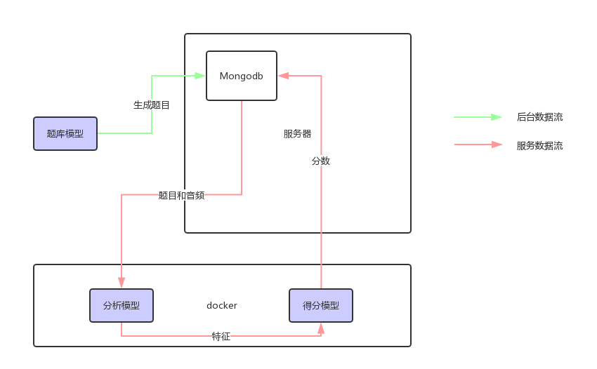
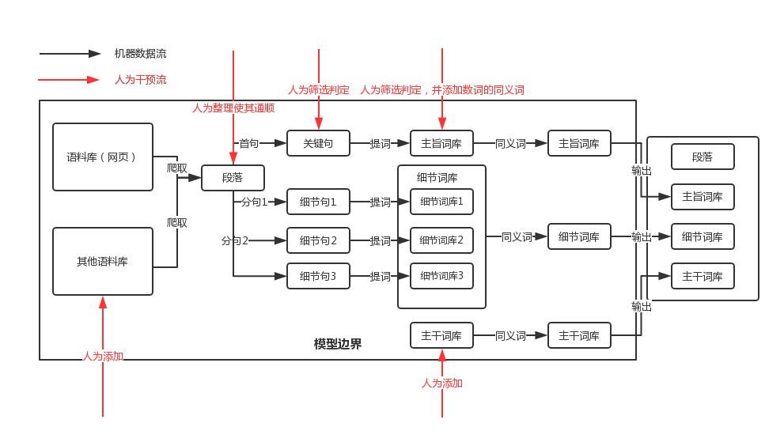
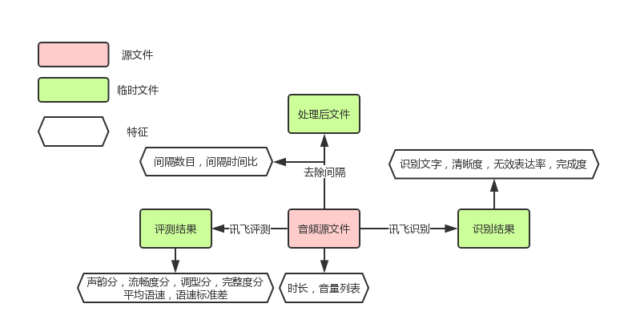
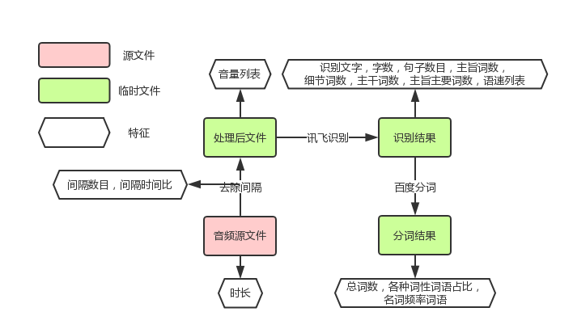
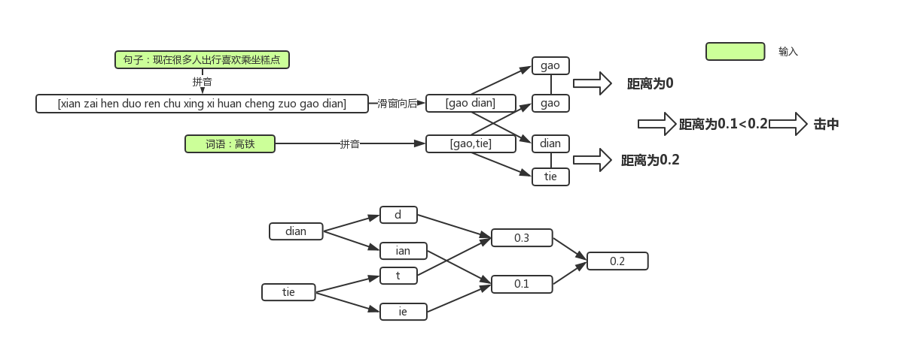

## 第二阶段模型概况

### 1. 综述

目前表达力评测系统中含有三个模型，分别是题库模型，特征提取模型（分析模型），评分模型。未来可能需要加入的模型还有推荐模型等。

目前三个模型存在数据流关系，如下图所示。

### 2. 题库模型

恒河沙数模型，这个模型需要从语料库中抽取并生成合适的测试题。

#### 2.1 总分（总）类型

这种题型的语料主要是百科全书等明显结构化的数据。这种题库的生成过程如下图所示。

这个模型中，除了红色部分标示的需要人为干预之外，还有一些模型参数需要人来控制，这些参数如下表所示。

| 步骤           | 参数               | 目前值                                                   |
| -------------- | ------------------ | -------------------------------------------------------- |
| 提取主旨关键词 | 词性               | 'a', 'an', 'n', 'ns', 'nr', 'nrt', 'nz', 'nt', 'vn'      |
| 提取主旨关键词 | 词数               | 5                                                        |
| 提取细节关键词 | 词性               | 'an', 'n', 'ns', 'nr', 'nrt', 'nz', 'nt', 'vn', 'm', 's' |
| 提取细节关键词 | 词数               | 5                                                        |
| 扩展同义词     | 同义词相似度最小值 | 0.7                                                      |

其中结巴分词的词性表缩略如下。

| 缩略 | 词性     | 来源                                                    |
| ---- | -------- | ------------------------------------------------------- |
| Ag   | 形语素   | 形容词性语素。形容词代码为 a，语素代码ｇ前面置以A。     |
| a    | 形容词   | 取英语形容词 adjective的第1个字母。                     |
| ad   | 副形词   | 直接作状语的形容词。形容词代码 a和副词代码d并在一起。   |
| an   | 名形词   | 具有名词功能的形容词。形容词代码 a和名词代码n并在一起。 |
| b    | 区别词   | 取汉字“别”的声母。                                      |
| c    | 连词     | 取英语连词 conjunction的第1个字母。                     |
| dg   | 副语素   | 副词性语素。副词代码为 d，语素代码ｇ前面置以D。         |
| d    | 副词     | 取 adverb的第2个字母，因其第1个字母已用于形容词。       |
| e    | 叹词     | 取英语叹词 exclamation的第1个字母。                     |
| f    | 方位词   | 取汉字“方”                                              |
| g    | 语素     | 绝大多数语素都能作为合成词的“词根”，取汉字“根”的声母。  |
| h    | 前接成分 | 取英语 head的第1个字母。                                |
| i    | 成语     | 取英语成语 idiom的第1个字母。                           |
| j    | 简称略语 | 取汉字“简”的声母。                                      |
| k    | 后接成分 |                                                         |
| l    | 习用语   | 习用语尚未成为成语，有点“临时性”，取“临”的声母。        |
| m    | 数词     | 取英语 numeral的第3个字母，n，u已有他用。               |
| Ng   | 名语素   | 名词性语素。名词代码为 n，语素代码ｇ前面置以N。         |
| n    | 名词     | 取英语名词 noun的第1个字母。                            |
| nr   | 人名     | 名词代码 n和“人(ren)”的声母并在一起。                   |
| ns   | 地名     | 名词代码 n和处所词代码s并在一起。                       |
| nt   | 机构团体 | “团”的声母为 t，名词代码n和t并在一起。                  |
| nz   | 其他专名 | “专”的声母的第 1个字母为z，名词代码n和z并在一起。       |
| o    | 拟声词   | 取英语拟声词 onomatopoeia的第1个字母。                  |
| p    | 介词     | 取英语介词 prepositional的第1个字母。                   |
| q    | 量词     | 取英语 quantity的第1个字母。                            |
| r    | 代词     | 取英语代词 pronoun的第2个字母,因p已用于介词。           |
| s    | 处所词   | 取英语 space的第1个字母。                               |
| tg   | 时语素   | 时间词性语素。时间词代码为 t,在语素的代码g前面置以T。   |
| t    | 时间词   | 取英语 time的第1个字母。                                |
| u    | 助词     | 取英语助词 auxiliary。                                  |
| vg   | 动语素   | 动词性语素。动词代码为 v。在语素的代码g前面置以V。      |
| v    | 动词     | 取英语动词 verb的第一个字母。                           |
| vd   | 副动词   | 直接作状语的动词。动词和副词的代码并在一起。            |
| vn   | 名动词   | 指具有名词功能的动词。动词和名词的代码并在一起。        |
| w    | 标点符号 |                                                         |
| x    | 非语素字 | 非语素字只是一个符号，字母 x通常用于代表未知数、符号。  |
| y    | 语气词   | 取汉字“语”的声母。                                      |
| z    | 状态词   | 取汉字“状”的声母的前一个字母。                          |
| un   | 未知词   | 不可识别词及用户自定义词组。取英文Unkonwn首两个字母。   |

#### 2.2 其他类型

暂时还没有设计

### 3. 分析模型

分析模型的输入是一个音频和一个题目。按照题目的类型分，一共有三种，分别是复述题，转述题和开放题。

#### 3.1 复述题

复述题需要讯飞的识别和评测接口，过程如下图所示。

其中各个特征的详细信息如下。

| 特征名                      | 计算方法                                                     |
| --------------------------- | ------------------------------------------------------------ |
| 识别文字 rcg_text           | 讯飞识别接口返回的文字                                       |
| 字数 num                    | 讯飞识别接口返回的文字除去标点的字数                         |
| 音频时长 last_time          | 用源文件的帧数除以码率                                       |
| 间隔数目 interval_num       | 调用webrtcvad模块的方法判定某一段是否是人声，如果不是就算作间隔 |
| 间隔时长占比 interval_ratio | 同上，计算出所有间隔时长之后与音频时长相比                   |
| 清晰度 clr_ratio            | 识别结果和标准结果对比有多少部分是说错的                     |
| 无效表达率 ftl_ratio        | 识别结果比标准结果多出的字数除以总字数                       |
| 完成度 cpl_ratio            | 标准结果有多少部分被正确地说出                               |
| 声韵分 phone_score          | 讯飞评测接口直接返回                                         |
| 流畅度分 fluency_score      | 讯飞评测接口直接返回                                         |
| 调型分 tone_score           | 讯飞评测接口直接返回                                         |
| 完整度分 integrity_score    | 讯飞评测接口直接返回                                         |
| 平均语速 speed              | 讯飞评测接口返回分句语速列表，求算数平均                     |
| 语速标准差 speed_deviation  | 讯飞评测接口返回分句语速列表，求标准差                       |
| 音量列表 volumes               | 音频分段之后的振动幅度平均大小                         |

这其中需要用到的参数如下表所示

| 参数                   | 目前所取值 |
| ---------------------- | ---------- |
| 可以算作间隔的最小时长 | 0.7s       |
| 分段测音量的段数       | 3          |

#### 3.2 转述题

转述题需要用到讯飞的识别接口和百度的分词接口，过程如下图所示。

其中各个特征的详细信息如下。

| 特征名 | 计算方法 |
| ------ | -------- |
| 识别文字 rcg_text           | 讯飞分段识别接口返回的文字拼接而成                             |
| 字数 num                    | 讯飞识别接口返回的文字除去标点的字数                         |
| 音频时长 last_time          | 用源文件的帧数除以码率                                       |
| 间隔数目 interval_num       | 调用webrtcvad模块的方法判定某一段是否是人声，如果不是就算作间隔 |
| 间隔时长占比 interval_ratio | 同上，计算出所有间隔时长之后与音频时长相比                   |
| 总词数 word_num | 百度分词接口返回的总词数（不包含标点） |
| 各种词性词语占比 x_ratio | 百度分词接口返回的各种词性的词数占总词数的比重 |
| 名词频率超过2的词数 noun_frequency_2 | 百度分词接口中名词词性且词频超过2的词数 |
| 名词频率超过3的词数 noun_frequency_3 | 百度分词接口中名词词性且词频超过3的词数 |
| 名词频率超过4的词数 noun_frequency_4 | 百度分词接口中名词词性且词频超过4的词数 |
| 句子数目 sentence_num | 讯飞识别结果中的句子数目 |
| 主旨词数 keywords_num | 第一项表示谐音击中的主旨词词数，第二项表示总的主旨词数，谐音部分详见3.4 |
| 细节词数 detailwords_nums | 细节词数是个列表，每一项是一个细节点，细节点的结构和主旨词数类似 |
| 主干词数 mainwords_num | 第一项表示谐音击中的主干词词数，第二项表示总的主干词词数 |
| 主旨主要词数 keywords_num_main | 在一定字数之前击中的主旨词数与总的主旨词数的占比 |
| 语速列表 speeds | 分段识别之后每一段的字数除以分的每一段的时长 |
| 音量列表 volumes            | 音频分段之后的振动幅度平均大小                   |

这其中需要用到的参数如下表所示。

| 参数                     | 目前所取值 |
| ------------------------ | ---------- |
| 分段识别的段数           | 3          |
| 可以算作间隔的最小时长   | 2.0s       |
| 主旨主要词数的前多少个字 | 30         |
| 分段测音量的段数         | 3          |

#### 3.3 开放题

开放题需要用到讯飞的识别接口和百度的分词接口，过程和转述题类似。

其中各个特征的详细信息如下。

| 特征名                               | 计算方法                                                     |
| ------------------------------------ | ------------------------------------------------------------ |
| 识别文字 rcg_text                    | 讯飞分段识别接口返回的文字拼接而成                           |
| 字数 num                             | 讯飞识别接口返回的文字除去标点的字数                         |
| 音频时长 last_time                   | 用源文件的帧数除以码率                                       |
| 间隔数目 interval_num                | 调用webrtcvad模块的方法判定某一段是否是人声，如果不是就算作间隔 |
| 间隔时长占比 interval_ratio          | 同上，计算出所有间隔时长之后与音频时长相比                   |
| 总词数 word_num                      | 百度分词接口返回的总词数（不包含标点）                       |
| 各种词性词语占比 x_ratio             | 百度分词接口返回的各种词性的词数占总词数的比重               |
| 名词频率超过2的词数 noun_frequency_2 | 百度分词接口中名词词性且词频超过2的词数                      |
| 名词频率超过3的词数 noun_frequency_3 | 百度分词接口中名词词性且词频超过3的词数                      |
| 名词频率超过4的词数 noun_frequency_4 | 百度分词接口中名词词性且词频超过4的词数                      |
| 句子数目 sentence_num                | 讯飞识别结果中的句子数目                                     |
| 总分类型词数目 sum-aspects_num       | 总分类型词击中词数                                           |
| 分点类型词数目 aspects_num           | 分点类型词击中词数                                           |
| 例子类型词数目 example_num           | 类型词击中词数                                               |
| 观点类型词数目 opinion_num           | 类型词击中词数                                               |
| 总结类型词数目 sum_num               | 类型词击中词数                                               |
| 因果类型词数目 cause-affect_num      | 类型词击中词数                                               |
| 转折类型词数目 transition_num        | 类型词击中词数                                               |
| 递进类型词数目 progressive_num       | 类型词击中词数                                               |
| 并列类型词数目 parallel_num          | 类型词击中词数                                               |
| 语速列表 speeds                      | 分段识别之后每一段的字数除以分的每一段的时长                 |
| 音量列表 vlumes                      | 音频分段之后的振动幅度平均大小                               |

这其中需要用到的参数如下表所示。

| 参数                     | 目前所取值 |
| ------------------------ | ---------- |
| 分段识别的段数           | 3          |
| 可以算作间隔的最小时长   | 2.0s       |
| 主旨主要词数的前多少个字 | 30         |
| 分段测音量的段数         | 3          |

#### 3.4 谐音部分

谐音单元是分析部分中重要的一环，词库击中均为谐音击中，谐音击中的流程如下图。

这其中需要用到的参数如下表所示。

| 参数               | 目前所取值       |
| ------------------ | ---------------- |
| 声母距离表         | 略               |
| 韵母距离表         | 略               |
| 单独成字韵母距离表 | 略               |
| 声母韵母求平均方式 | 加权算数平均     |
| 声母韵母权重       | 声母：1，韵母：1 |
| 是否击中阈值       | 0.2              |

### 4. 评分模型

评分模型会对三种题型分别评分，最后计算总分。

#### 4.1 复述题

复述题的评分点如下所示。

| 评分点     | 评分规则                                                     |
| ---------- | ------------------------------------------------------------ |
| 清晰度clr     | 少于1的部分，每少0.01扣2分，扣满18分为止                     |
| 无效表达率ftl | 大于0的部分，每多0.01扣3分，扣满100分为止                     |
| 时长       | 超过35s，每多1s扣3分，扣满15分为止；低于30s，每少1s扣3分，扣满15分为止 |
| 声韵分     | 少于95分的部分，每少1分扣0.3分，扣满9分为止                  |
| 流畅度分   | 少于85分的部分，每少1分扣0.3分，扣满9分为止                  |
| 口音分     | 少于90分的部分，每少1分扣0.3分，扣满9分为止                  |
| 完整度分   | 少于99分的部分，每少1分扣0.3分，扣满9分为止                  |
| 间隔       | 每有1个间隔扣5分，扣满10分为止                               |
| 完成度cpl     | 乘上完整度                                                   |

#### 4.2 转述题

转述题的评分点如下所示。

| 得分点     | 评分规则                                                 |
| ---------- | -------------------------------------------------------- |
| 关键词数   | 关键词权重向量乘上关键词击中                                |
| 细节词数   | 细节词权重向量乘上细节词命中                               |

#### 4.3 开放题

开放题的评分点如下所示。

| 得分点     | 评分规则                                                     |
| ---------- | ------------------------------------------------------------ |
| 结构词类数 | 有3类以上，基础分80分，2类基础分70，否则55                   |
| 细节词类数 | 有3类以上，基础分80分，2类基础分75，否则60                   |
| 字数       | 280字以上×1.2，45到120字×0.5,10到45字×0.25，5到10字×0.05，少于5字直接0分 |

